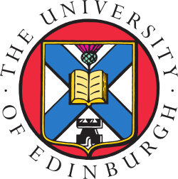

# Computer Scientist |  AI Scientist | Data Scientist
**Technical Skills: Python, SQL, Java, C++**

## Education

  <table>
    <tr>
      <td></td>
      <td valign="middle"><strong>Artificial Intelligence, MSc, University of Edinburgh [2017]  </strong></td>
    </tr>
  </table>

  <table>
    <tr>
      <td></td>
      <td valign="middle"><strong>Computer Science, BSc, University College Dublin [2013]  </strong></td>
    </tr>
  </table>

## Certifications
IBM Data Science Specialization, Coursera [2025]

## Work Experience

**Instructor @ Computer Science Department, Nazarbayev University _[2018 - 2025]_**
<ul>
  <li><b>Delivered engaging instructions:</b> Designed and taught undergraduate courses in computer science including <i> Data Structures and Algorithms, Programming for Scientist and Engineers, Programming Languages, Research Methods</i> using C, C++, Python, Java </li>
  <li><b>Developed Curriculum and Assessments:</b> Created syllabi, coding assignments and exams aligned with indstry trends.</li>
  <li><b>Mentored and Advised Students:</b> Provided one-on-one guidance during office hours to troubleshoot technical and coding issues.</li>
  <li><b>Contributed to Department Innovation:</b> Served on curriculum committees for Research Methods, hiring committees, and organised LT&T coding workshops to enhance student participation at competitions.</li>
</ul>

**Research Assistant @ Robotics and Mechatronics Department, Nazarbayev University _[2014 - 2018]_**
<ul>
  <li> <b> Grok</b> </li>
  <li>ALso dig up projects done in robotics at NU during your times </li>
</ul>

**Robotics Club Instructor @ Nazarbayev Intellectual Schools _[2015-2016]_**

**Project Engineer Intern @ Microsoft _[2013]_**

## Relevant Publications
1. Tazhigaliyeva, Nazgul, et al. "Cyrillic manual alphabet recognition in RGB and RGB-D data for sign
language interpreting robotic system (SLIRS)." Robotics and Automation (ICRA), 2017 IEEE
International Conference on. IEEE, 2017.
2. Folgheraiter, Michele, Nazgul Tazhigaliyeva, and Aibek Niyetkaliyev. "Adaptive joint trajectory
generator based on a chaotic recurrent neural network." Development and Learning and Epigenetic
Robotics (ICDL-EpiRob), 2015 Joint IEEE International Conference on. IEEE, 2015.

