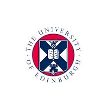

# Computer Scientist |  AI Scientist | Data Scientist
**Technical Skills: Python, SQL, Java, C++**

## Education
  Artificial Intelligence, MSc, University of Edinburgh [2017]  
 Computer Science, BSc, University College Dublin [2013]

## Certifications
IBM Data Science Specialization, Coursera [2025]

## Work Experience
**Instructor @ Computer Science Department, Nazarbayev University _[2018 - 2025]_**
**Research Assistant @ Robotics and Mechatronics Department, Nazarbayev University _[2014 - 2018]_**
**Robotics Club Instructor @ Nazarbayev Intellectual Schools _[2015-2016]_**
**Project Engineer Intern @ Microsoft _[2013]_**

## Relevant Publications
1. Tazhigaliyeva, Nazgul, et al. "Cyrillic manual alphabet recognition in RGB and RGB-D data for sign
language interpreting robotic system (SLIRS)." Robotics and Automation (ICRA), 2017 IEEE
International Conference on. IEEE, 2017.
2. Folgheraiter, Michele, Nazgul Tazhigaliyeva, and Aibek Niyetkaliyev. "Adaptive joint trajectory
generator based on a chaotic recurrent neural network." Development and Learning and Epigenetic
Robotics (ICDL-EpiRob), 2015 Joint IEEE International Conference on. IEEE, 2015.

